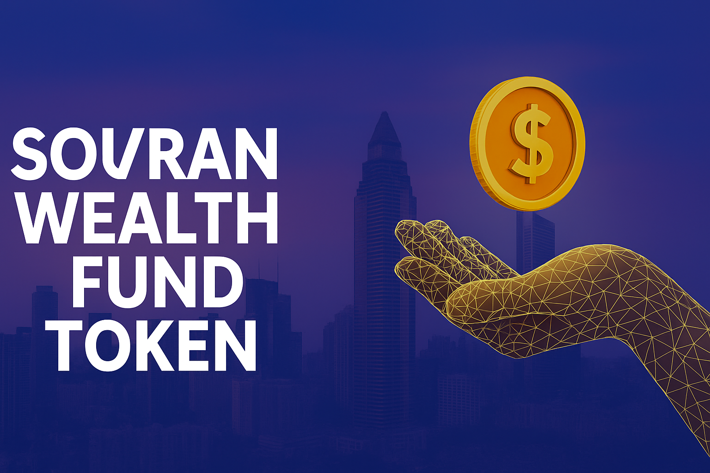

  

       

  

<h1 align="center">Sovran Wealth Fund Token (SWF)</h1>

  <strong>Official BSC Smart Contract for SWF Token</strong> 
  <em>Gold-Backed | Real Estate Tokenized | Upgradeable ERC20</em>

🔹 Overview

The Sovran Wealth Fund Token (SWF) is a next-generation digital asset deployed on Binance Smart Chain (BSC) that fuses real estate tokenization, gold-backed certificates via Kinesis, and modular upgradeability. SWF is designed to empower decentralized wealth building through sovereignty, security, and shared value.

---

🚀 Deployed Contract

Network: Binance Smart Chain (Mainnet)

Contract Address: 0x83E17aeB148d9b4b7Be0Be7C87dd73531a5a5738

Compiler Version: v0.8.20

Optimization: Enabled (200 runs)

---

🔐 Key Features

Feature	Description

🔁 Upgradeable	Fully proxy-compatible and upgradeable via OpenZeppelin's UUPS pattern

🏠 Real Estate Tokenization	Integrated RealEstateAsset struct to tokenize physical property metadata

🪙 Kinesis Gold Integration	Certifies ownership with GoldCertificate struct tied to physical grams

🪂 Airdrop with MerkleProof	Claim-based airdrop mechanism for whitelisted participants

💥 Burnable	Holders can burn tokens, reducing supply

📥 Mintable	Only the owner can mint new SWF tokens

🛡️ Ownable & Secure	OpenZeppelin Ownable, Context, and Address safeguards applied

---

🧱 Struct Definitions

Real Estate Backing

struct RealEstateAsset {
  string propertyId;
  string location;
  uint256 valuation;
  uint256 backingTokenId;
}

struct GoldCertificate {
  uint256 grams;
  string certificateId;
}

---

📊 Token Allocation — Solo Method (16 Wallet Strategy)

The Sovran Wealth Fund (SWF) token follows a unique 16-wallet architecture called the Solo Method. Each wallet has a designated role and allocation from the 10,001,000,000 SWF total supply.

Wallet Name	Allocation (SWF)	Function / Purpose
| 🏦 Wallet Name                | 🧾 Allocation (SWF)      | 🎯 Purpose                                                                 |
|------------------------------|--------------------------|---------------------------------------------------------------------------|
| 👑 Owner Reserve             | 620,065,000 SWF          | Founder's reserve + remaining unallocated tokens                         |
| 🏠 Real Estate Vault         | 1,500,150,000 SWF        | Tokenized physical property backing                                      |
| 🪙 Gold Cert Backing         | 2,900,290,000 SWF        | Backing by gold via Kinesis                                              |
| 🌊 Liquidity Deployment      | 1,000,100,000 SWF        | Liquidity pools, swaps, and market-making                                |
| 🎁 Staking Reward Vault      | 1,000,100,000 SWF        | LP staking rewards, long-term holder incentives                          |
| 📡 Community Airdrop         | 500,050,000 SWF          | Merkle airdrops & whitelist distributions                                |
| 💻 Dev Fund                  | 500,050,000 SWF          | Core dev bounties, contract upgrades, QA                                 |
| 📣 Marketing & Partnerships  | 500,050,000 SWF          | Brand campaigns, sponsorships, and influencer collabs                    |
| 🏛️ Treasury Reserve          | 500,050,000 SWF          | Moabite Federation sovereign treasury                                    |
| 🧱 Foundation Wallet         | 400,040,000 SWF          | Operations, compliance, legal defense                                    |
| 🗳️ DAO Governance Vault      | 250,025,000 SWF          | On-chain proposal voting rewards                                         |
| 🚰 Faucet Reserve            | 200,020,000 SWF          | Incentivized faucets and onboarding portals                              |
| 🖼️ NFT/Asset Tokenization    | 50,005,000 SWF           | NFT utilities and tokenized real-world asset platforms                   |
| 🛍️ Merchant Onboarding       | 50,005,000 SWF           | Merchant adoption and commerce incentives                                |
| 🚀 SGCF – Builder Grants      | 10,000,000 SWF           | Grants to devs & builders of Sovran ecosystem                            |
| 💹 SGCF – Stability Support   | 10,000,000 SWF           | LP cushion during volatility and buybacks                                |
| 🌍 SGCF – Community Outreach  | 10,000,000 SWF           | Ambassador programs, staking contests, referral rewards                  |

| **🧾 Total Supply**           | **10,001,000,000 SWF**    | 100% structured across all wallets                                       |

Token Contract: 0x83E17aeB148d9b4b7Be0Be7C87dd73531a5a5738
(Decimals: 18)

Network: Binance Smart Chain (BSC)

---

👤 Author & Maintainer

Hasan Sa’Raam Bey Al-Moabiyah
Grand Vizier of The Moabite Federation PMA
Lead Developer of the Sovran Wealth Fund Ecosystem

📧 akiliaggroup@gmail.com

🌐 www.SovranWealthFund.org
